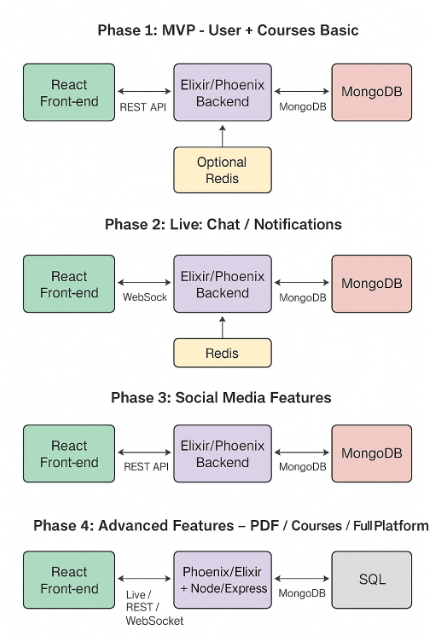

<pre>  
# _MVP_Elixir-Phoneix-js-typescript-golang-nodejs-express-redis-nginx-React-3

🌟 Technologies Used
Frontend: React + TypeScript – dynamic, reactive, and blazing fast UI.
Backend: Node.js + Express & GoLang – robust APIs and concurrent processing.
Realtime & Streams: Phoenix + Elixir – live features like stories, messages, and notifications in milliseconds.
Caching & Performance: Redis – minimize DB hits, supercharge likes/views counter.
Server Management: Nginx – handle massive requests and load balancing.
Database: PostgreSQL / MongoDB – structured + flexible storage for all your content.
Build & Tooling: TypeScript + modern JS modules for scalable codebase.

🔥 Features
Stories & Posts: Instant updates with caching to prevent server overload.
Likes & Views Counter: Real-time with batch DB updates via Redis.
Live Notifications: Powered by Phoenix Channels & WebSockets.
Multi-Language API: TypeScript and GoLang microservices.
Scalable Architecture: Microservices-ready, load-balanced via Nginx.
Ultra-Fast Performance: Optimized caching, concurrency, and async processing.

🎯 MVP Vision
The goal is to create a production-ready MVP that can:
Handle millions of users interacting in real-time.
Deliver instant feedback on likes, views, and messages.
Provide a full-stack experience combining modern JS, Elixir, and GoLang.
Be a foundation for a social platform like Instagram or TikTok.

📈 Why This Project Rocks
Learn cutting-edge full-stack development.
Master Elixir + Phoenix for real-time apps.
Handle caching, rate-limiting, and load balancing like a pro.
Build a portfolio piece that screams: I can handle Instagram-scale platforms.

💡 Future Plans
Add live video streaming
Integrate AI-powered content recommendations
Add push notifications & mobile support

  </pre>
